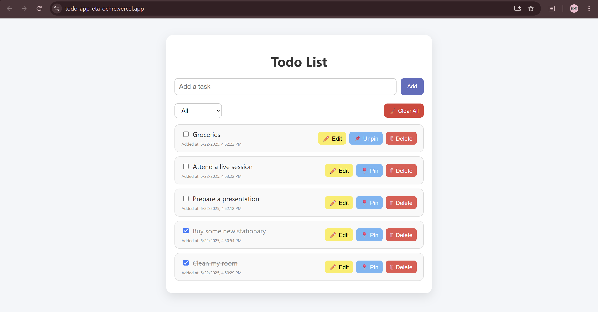
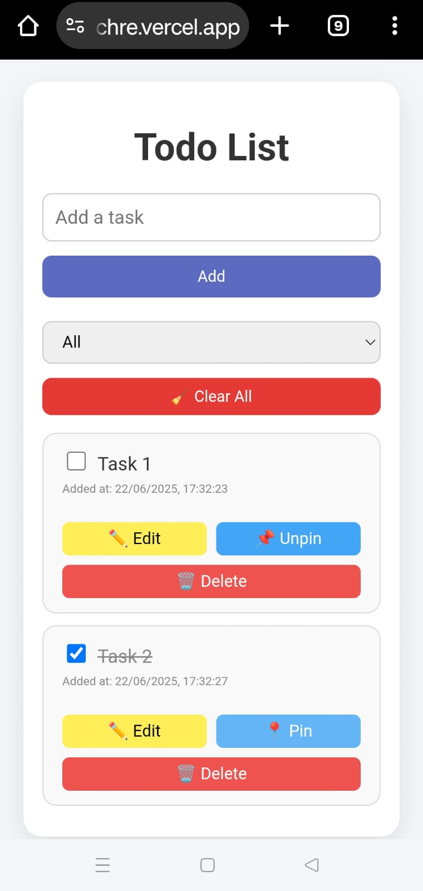
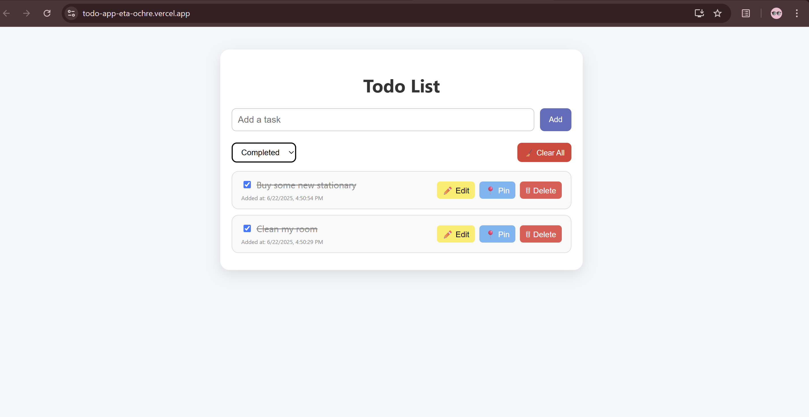
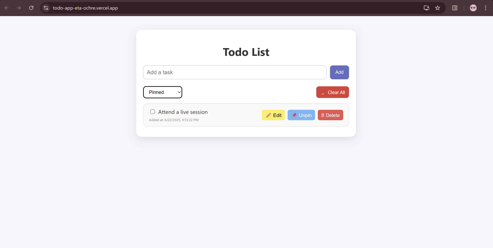

# React ToDo List Web App

A clean and user-friendly to-do list application built using React. It supports CRUD operations(Create, Read, Update and Delete) with a decent user interface.

---


Check the demo hosted on vercel https://todo-app-eta-ochre.vercel.app/

---

## Table of Contents

- [Tech Stacks](#tech-stacks)
- [Features](#features)
- [Project Structure](#project-structure)
- [Screenshots](#screenshots)
- [Installation](#installation)
- [Usage](#usage)


---

## Tech Stacks
- Frontend : React
- Styling : CSS
- Persistence : Browser Local Storage

---


## Features
- Add New Tasks
- Delete existing tasks
- Pin/Unpin tasks to sort by importance
- Mark Tasks as Completed / Incomplete
- Edit task text
- Filter by: All / Completed / Pinned
- Data saved in browser(localStorage)
- Fully mobile responsive UI with clean layout


---

## Project Structure
```bash
├── public/
│   ├── favicon.ico
│   ├── index.html
│   ├── logo192.png
│   ├── logo512.png
│   ├── manifest.json
│   └── robots.txt
├── src/
│   ├── App.css
│   ├── App.js
│   ├── App.test.js
│   ├── index.css
│   ├── index.js
│   ├── logo.svg
│   ├── reportWebVitals.js
│   └── setupTests.js
├── .gitignore
├── package-lock.json
├── package.json
└── README.md
```
---

## 📸 Screenshots

### Desktop View


### Mobile View


### Completed Tasks


### Pinned Tasks


---

## Installation

### Pre-requisites
- Node.js 
- npm (comes with Node.js)

### Steps

1. Clone this repository:
   Open your terminal and run:

   ```bash
   git clone https://github.com/RamaSaiAnuhya/react-todo-app.git
   ```
   
2. Navigate to the project directory

   ```bash
   cd react-todo-app
   ```
   
3. Install dependencies
   Make sure you have Node.js installed, then run:

   ```bash
   npm install
   ```

4. Start the development server

   ```bash
   npm start
   ```

The app should now  be running at http://localhost:3000


